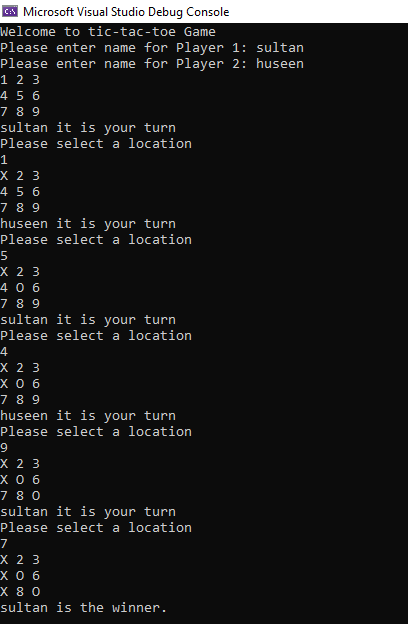

# TicTacToe 
Create a two (2) person, turn based Tic-Tac-Toe program. Building off of your starter code provided from the class repo, complete the Tic Tac Toe logic. Refer to the “Submit this Assignment” section below on instructions with the starter code.

 ## what the program looks like

